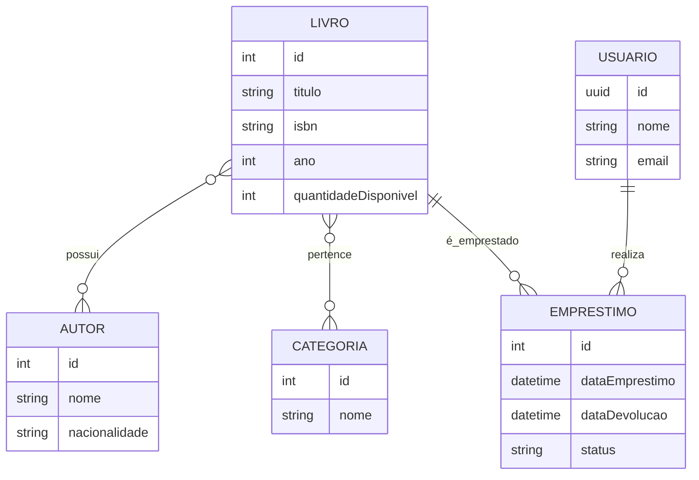

# 📚 Sistema de Biblioteca

API REST desenvolvida em **Java com Spring Boot** para gerenciamento de uma biblioteca.

O projeto permite cadastrar e consultar **livros, autores, categorias, usuários e empréstimos**, aplicando relacionamentos entre as entidades, regras de negócio de controle de estoque e persistência dos dados em banco de dados relacional.

---

## 📖 Sobre o projeto

Este projeto simula o backend de um sistema de biblioteca, onde é possível:

- Cadastrar livros e associá-los a múltiplos autores e categorias
- Gerenciar o cadastro de usuários
- Registrar empréstimos de livros, com controle automático da quantidade de exemplares disponíveis
- Consultar, atualizar e remover qualquer um desses recursos via API REST

O foco do projeto é praticar **arquitetura em camadas**, **mapeamento objeto-relacional (JPA/Hibernate)** e **regras de negócio** aplicadas a relacionamentos complexos (muitos-para-muitos e um-para-muitos).

---

## 🗂️ Modelo de dados



- **Livro ↔ Autor**: relação muitos-para-muitos
- **Livro ↔ Categoria**: relação muitos-para-muitos
- **Usuário → Empréstimo**: um usuário pode ter vários empréstimos
- **Livro → Empréstimo**: um livro pode ter vários empréstimos ao longo do tempo

---

## ✅ Regras de negócio

- Um livro só pode ser emprestado se `quantidadeDisponivel` for maior que zero.
- Ao registrar um empréstimo, a quantidade disponível do livro é **decrementada** automaticamente.
- Ao atualizar um empréstimo para o status `DEVOLVIDO`, a quantidade disponível do livro é **incrementada** de volta.
- Livros podem estar associados a múltiplos autores e múltiplas categorias simultaneamente.

---

## 🚀 Funcionalidades

- Cadastro, consulta, atualização e exclusão de **livros**
- Cadastro, consulta, atualização e exclusão de **autores**
- Cadastro, consulta, atualização e exclusão de **categorias**
- Cadastro, consulta, atualização e exclusão de **usuários**
- Cadastro, consulta, atualização e exclusão de **empréstimos**
- Relacionamento entre livros, autores, categorias, usuários e empréstimos
- Controle da quantidade disponível de livros durante os empréstimos

---

## 🛠️ Tecnologias utilizadas

- **Java 17**
- **Spring Boot 3**
- **Spring Data JPA**
- **Hibernate**
- **Maven**
- **MySQL**
- **Lombok**
- **Postman** para testes da API

---

## 📋 Pré-requisitos

Antes de rodar o projeto, você precisa ter instalado:

- [Java JDK 17+](https://adoptium.net/)
- [Maven 3.8+](https://maven.apache.org/) (ou usar o `mvnw` incluso no projeto)
- [MySQL 8+](https://dev.mysql.com/downloads/)
- [Postman](https://www.postman.com/) ou similar para testar os endpoints

---

## 📁 Estrutura do projeto

```text
src
└── main
    └── java
        └── com.luiza.primeiroprojetocomspring
            ├── controller
            ├── database
            │   ├── model
            │   └── repository
            ├── dto
            └── service
```

### Controller
Responsável por receber as requisições HTTP e direcioná-las para os Services.

### Service
Contém as regras de negócio da aplicação, como criação, atualização, busca e exclusão dos registros.

### Model
Contém as entidades utilizadas para representar os dados no banco de dados.

### Repository
Responsável pela comunicação entre a aplicação e o banco de dados utilizando Spring Data JPA.

### DTO
Objetos utilizados para transportar os dados entre as requisições e a aplicação.

---

## ⚙️ Como executar

### 1. Clone o projeto

```bash
git clone <URL_DO_REPOSITORIO>
cd primeiro-projeto-com-spring
```

### 2. Configure o banco de dados

Crie um banco de dados MySQL para o projeto:

```sql
CREATE DATABASE biblioteca;
```

Configure as informações de conexão no arquivo `src/main/resources/application.yml`:

```yaml
spring:
  datasource:
    url: jdbc:mysql://localhost:3306/biblioteca
    username: seu_usuario
    password: sua_senha
  jpa:
    hibernate:
      ddl-auto: update
    show-sql: true
```

> ⚠️ Não coloque senhas reais ou outras informações sensíveis no repositório.

Após iniciar, a API estará disponível em `http://localhost:8080`.

---

## 🔗 Endpoints da API

### Livros

| Método | Endpoint         | Descrição                  | Status de sucesso |
|--------|------------------|-----------------------------|--------------------|
| GET    | `/livro`         | Lista todos os livros       | 200 OK             |
| GET    | `/livro/{id}`    | Busca um livro por id       | 200 OK             |
| POST   | `/livro`         | Cadastra um novo livro      | 201 Created        |
| PUT    | `/livro/{id}`    | Atualiza um livro existente | 200 OK             |
| DELETE | `/livro/{id}`    | Remove um livro             | 204 No Content     |

### Autores

| Método | Endpoint         | Descrição                    | Status de sucesso |
|--------|------------------|-------------------------------|--------------------|
| GET    | `/autor`         | Lista todos os autores        | 200 OK             |
| GET    | `/autor/{id}`    | Busca um autor por id         | 200 OK             |
| POST   | `/autor`         | Cadastra um novo autor        | 201 Created        |
| PUT    | `/autor/{id}`    | Atualiza um autor existente   | 200 OK             |
| DELETE | `/autor/{id}`    | Remove um autor               | 204 No Content     |

### Categorias

| Método | Endpoint            | Descrição                        | Status de sucesso |
|--------|---------------------|------------------------------------|--------------------|
| GET    | `/categoria`        | Lista todas as categorias          | 200 OK             |
| GET    | `/categoria/{id}`   | Busca uma categoria por id         | 200 OK             |
| POST   | `/categoria`        | Cadastra uma nova categoria        | 201 Created        |
| PUT    | `/categoria/{id}`   | Atualiza uma categoria existente   | 200 OK             |
| DELETE | `/categoria/{id}`   | Remove uma categoria               | 204 No Content     |

### Usuários

| Método | Endpoint           | Descrição                      | Status de sucesso |
|--------|--------------------|----------------------------------|--------------------|
| GET    | `/usuario`         | Lista todos os usuários          | 200 OK             |
| GET    | `/usuario/{id}`    | Busca um usuário por id          | 200 OK             |
| POST   | `/usuario`         | Cadastra um novo usuário         | 201 Created        |
| PUT    | `/usuario/{id}`    | Atualiza um usuário existente    | 200 OK             |
| DELETE | `/usuario/{id}`    | Remove um usuário                | 204 No Content     |

### Empréstimos

| Método | Endpoint              | Descrição                          | Status de sucesso |
|--------|-----------------------|--------------------------------------|--------------------|
| GET    | `/emprestimo`         | Lista todos os empréstimos           | 200 OK             |
| GET    | `/emprestimo/{id}`    | Busca um empréstimo por id           | 200 OK             |
| POST   | `/emprestimo`         | Registra um novo empréstimo          | 201 Created        |
| PUT    | `/emprestimo/{id}`    | Atualiza um empréstimo existente     | 200 OK             |
| DELETE | `/emprestimo/{id}`    | Remove um empréstimo                 | 204 No Content     |

---

## 🧪 Testando a API

As requisições podem ser feitas com **Postman** ou **Insomnia**.

### Cadastrar um autor

```http
POST /autor
Content-Type: application/json
```
```json
{
    "nome": "Machado de Assis",
    "nacionalidade": "Brasileira",
    "livros": []
}
```

**Resposta (201 Created):**
```json
{
    "id": 1,
    "nome": "Machado de Assis",
    "nacionalidade": "Brasileira",
    "livros": []
}
```

### Cadastrar um livro

```http
POST /livro
Content-Type: application/json
```
```json
{
    "titulo": "Dom Casmurro",
    "isbn": "978-85-01-00000-0",
    "ano": 1899,
    "quantidadeDisponivel": 5,
    "autores": [1],
    "categorias": [1]
}
```

**Resposta (201 Created):**
```json
{
    "id": 1,
    "titulo": "Dom Casmurro",
    "isbn": "978-85-01-00000-0",
    "ano": 1899,
    "quantidadeDisponivel": 5,
    "autores": [1],
    "categorias": [1]
}
```

### Criar um empréstimo

```http
POST /emprestimo
Content-Type: application/json
```
```json
{
    "dataEmprestimo": "2026-08-30T10:00:00",
    "dataDevolucao": "2026-09-30T10:00:00",
    "status": "EMPRESTADO",
    "usuario": "a1b2c3d4-e5f6-7890-abcd-ef1234567890",
    "livro": 1
}
```

**Resposta (201 Created):**
```json
{
    "id": 1,
    "dataEmprestimo": "2026-08-30T10:00:00",
    "dataDevolucao": "2026-09-30T10:00:00",
    "status": "EMPRESTADO",
    "usuario": "a1b2c3d4-e5f6-7890-abcd-ef1234567890",
    "livro": 1
}
```

> Após esse cadastro, o campo `quantidadeDisponivel` do livro de id `1` é automaticamente decrementado em 1.

### Registrar a devolução

```http
PUT /emprestimo/1
Content-Type: application/json
```
```json
{
    "dataEmprestimo": "2026-08-30T10:00:00",
    "dataDevolucao": "2026-09-05T15:00:00",
    "status": "DEVOLVIDO",
    "usuario": "a1b2c3d4-e5f6-7890-abcd-ef1234567890",
    "livro": 1
}
```

> Ao atualizar o status para `DEVOLVIDO`, o campo `quantidadeDisponivel` do livro é incrementado novamente.

---
## 📌 Objetivo

Este projeto foi desenvolvido com o objetivo de praticar o desenvolvimento de **APIs REST utilizando Java e Spring Boot**, trabalhando conceitos como:

- Arquitetura em camadas
- CRUD
- Spring Data JPA
- Mapeamento objeto-relacional
- Relacionamentos entre entidades (muitos-para-muitos e um-para-muitos)
- DTOs
- Regras de negócio
- Requisições HTTP
- Persistência de dados em banco de dados

---

## 📄 Licença

Este projeto é de uso educacional, desenvolvido para fins de estudo em Ciência da Computação.
